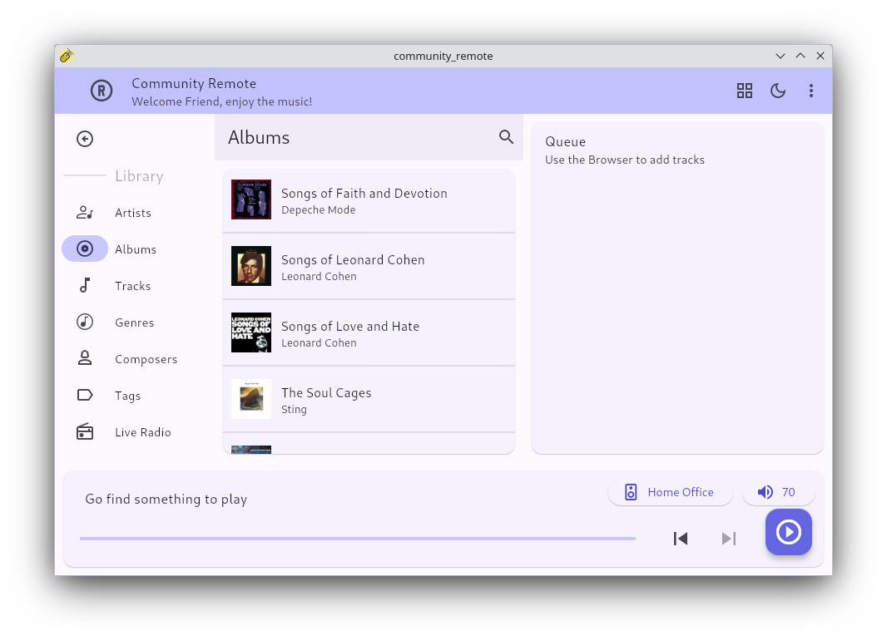
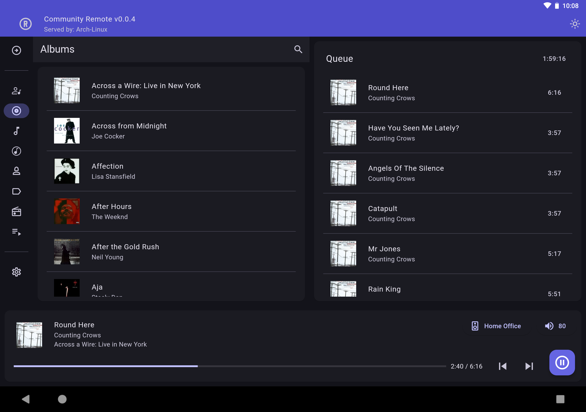

# Community Remote
Play Roon the community way

## Early Development Stage
Community Remote is in early development, with a current focus on Linux support. To be able to use on other platforms things like, Android sideloading, Windows security warnings, etc. should not scare you off.

## Supported Platforms
Currently supported platforms are Linux, Android and Windows, with a fixed desktop layout (i.e. PC, tablet only).

The project is named Community Remote to emphasize that, in order to have maximum platform support, community collaboration is necessary.

### Linux

### Android

### Windows

## Developers Helicopter View
The Community Remote consists out of three main buidling blocks.

### Rust Roon API
The Rust Roon Api provides the backend that takes care of the communication with the Roon Server. It takes care of requesting the data that is made visible in the UI and provides control actions that can be triggered from the UI.

https://github.com/TheAppgineer/rust-roon-api

### Flutter
The frontend is developed in Flutter / Dart, this brings multi platform from a single code base. The out of the box functionalities, like Material Design, take care of quick development and a consistent look. Flutter uses the Dart programming language.

https://docs.flutter.dev/

### Flutter Rust Bridge
To bridge the gap between the Dart frontend and the Rust backend the Flutter Rust Bridge is used. This generates the glue code to call Rust functions from Flutter / Dart and bring data from the Rust backend to the Flutter frontend.

https://cjycode.com/flutter_rust_bridge

## Building from Source

### Install Flutter / Dart for your platform of choise
https://docs.flutter.dev/get-started/install

### Install Rust
Visit [rustup.rs](https://rustup.rs/) and follow the provided instructions.

### Build Flutter Rust Bridge
    cargo install 'flutter_rust_bridge_codegen@^2.0.0'

### Build Community Remote
A debug build can be built and run from Visual Studio Code.

To build for Linux

    flutter build linux --release

To build an apk for Android

    flutter build apk --release

To build for Windows

    flutter build windows --release
