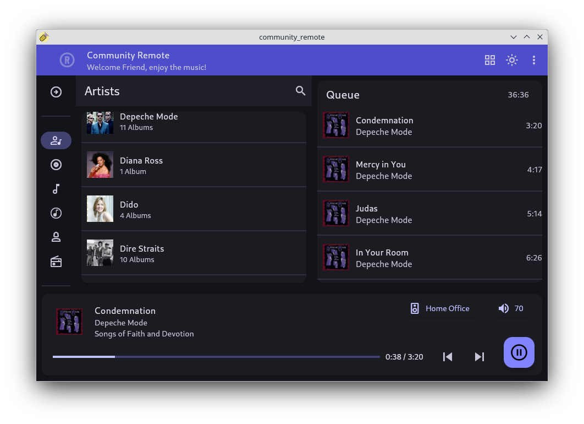

# Why Community Remote?
Community Remote has a focus on use-cases not covered by the official Roon app.
Linux support is the obvious one, others are access control, random album playback and more.

## The Lightweight Roon GUI for Linux
Linux support provided by Roon Labs ends at the Roon Server offering. If a Roon Remote or GUI for Linux is wanted the unsupported tinkering solutions have to be used. The common path chosen here is the Roon on Wine solution, but it is picky on Wine versions and can be high on resources.

If quick access and lightweight is prefered over fully featured, then Community Remote can be a good alternative. By using the Flathub universal Linux packaging it can be installed on about any Linux distribution.

## Roon Control for Family and Friends
With Community Remote the level of access to the Roon system can be restricted. Giving family and friends access using the official Roon app gives them access to every feature, profile and zone available in Roon, but this might not be desired. With Community Remote the available profiles and zones can be restricted independently for each phone, tablet or laptop connected to the Roon system. This setup is done in the Extensions setup of the Roon app, each connected Community Remote will have its own entry in the list. See [First time setup](#first-time-setup) for details.

### Profile selection
The profile can remain selectable or given a fixed assignment. By assigning a fixed profile to a Community Remote install you prevent that play histories get polluted due to use of the incorrect profile. A fixed profile is indicated by the disable profile button at the left of the app bar.

*Note: The profile button is not available on the small (phone) layout.*

### Output whitelisting
In the extension Settings you can specify the outputs (Roon Endpoints) that are accessible by Community Remote. Only (grouped) zones for which all outputs are on the whilelist will appear in the zone selection dialog.

This feature is created with the family and friends use case in mind, preventing them from e.g. accessing the main system. But there are more use cases. For a desktop Linux system it might make sense to only control zones on the same floor, or prevent accidental control of a zone in one of the bedrooms.

## The Roon Companion Remote
The official Roon app is the obvious point of access when using Roon, but having an alternative can help when running into issues, like accessing the Roon Server. Community Remote is the companion at hand when the need arises.

# How to Get it?
### For Linux you can:

Both the x86_64 (PC) and aarch64 (Arm64) architecture are supported.

### For Android you can:

Click or scan the QR Code.

### Visit the project [Release Page](https://github.com/TheAppgineer/community_remote/releases/latest) for all available releases.

 

# How to Use?
## First Time Setup
Use the offical Roon app and open the Settings from the hamburger menu. Select the Extensions tab and Enable the Community Remote extension, then select its Settings. Within the Settings any profile or output restrictions can be setup, confirm settings by selecting Save.

 

## Overview
The Community Remote home screen has the following top level controls:

1. Navigation Rail: Used to select the category displayed in the Browser
2. Browser: Used to browse the hierarchy of the selected category
3. Queue: Shows the queued list of songs to play
4. Now Playing: Shows the metadata of the current song, click for opening Now Playing screen
5. Zone Select: Select the zone to control
6. Volume Control: Set the volume of the outputs of the zone
7. Next, Prev: progress to next or previous track
8. Quick Access Button: main action for current context, normally Play/Pause, alternatively Server Connect or Zone Select

## Feature Highlights
### Random Album or Track Selection
The Browser supports the adding of random Albums or Tracks by means of the Pick Random entry. Queue up multiple random entries to prepare for a lazy listening session. The default action is to append to the Queue, but specific actions can be selected via the drop down menu.

### Category Hiding
By long pressing one of the icons on the navigation rail at the left, the rail will open up with all icons changed to toggles. With these toggles the categories that are not needed can be hidden.

*Note: This feature is not available on the small (phone) layout.*

 

### Wikipedia Info
When browsing an Artist or Album there is an About entry, when selected the artist or album is searched for on Wikipedia and if found the information is displayed.

When in the Now Playing screen the Artist and Album of the current track are also searched for on Wikipedia. Toggling between album and artist information is done via the button in the top right corner.

# How to Support the Project?
If you like Community Remote as an addition to your Roon setup then you might consider a donation. Donations will be used for recurring costs like domain renewal or to buy hardware needed to support the different platforms.

 

You can also contribute by reporting issues or providing pull requests over on [GitHub](https://github.com/TheAppgineer/community_remote).
